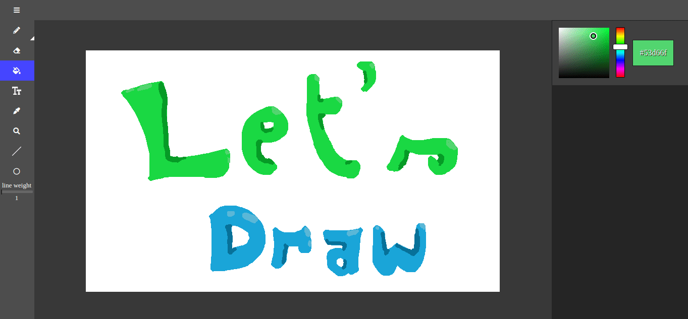

# letsdraw

A paint like app

## About

This app is part of my journey with **JS**. This app idea was just to build a canvas and a pencil, but I started to create some more functionalities, and practice some concepts of JS and coding and now it has a little bit more features than that. The pencil, was built from scratch, because the way that some canvas API methods work was leading to small issues. The color picker, was built with canvas and some pixels manipulation, because I really wanted to create a color picker from scratch, and the bucket fill was built using the flood fill algorithm. I really enjoy this project and I'll continue to add some features and changes. So this project still in progress.

## Demo
</br>

If you want to give it a try click the link below: </br>
[letsdraw](https://gabriellima77.github.io/letsdraw/)

## Getting started
If you want to use this app locally, or make your own changes, follow the step below: </br>
```
git clone git@github.com:gabriellima77/letsdraw.git
```
and start coding :smile:

## Features
- Ctrl + Z to return one step;
- A pencil and a brush. Pencil been the default;
- A eraser;
- Text tool with font-size input;
- Shapes tool with circle, square and triangle;
- A dropper;
- Bucket fill;
- Line tool;
- File menu, where you can download your image and clear the canvas;

## Coming soon

- [ ] Zoom tool; 
- [ ] Layers;
- [ ] Image manipulation;
- [ ] Queue of last used colors;
- [ ] Ctrl + Y to go forward one step;
- [ ] Rectangle selection tool;
- [ ] Symmetry tool;</br>
...

## Built with
- *JS*
- *CSS*
- *HTML*
- *Canvas API*
- *Font Awesome*
- *Figma*
